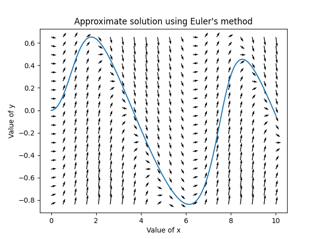

# Euler's Method Visualizer

The purpose of this code is to visualize Euler's method when approximating
solutions to a differential equation. 

## Example

You can run this code on your machine by
    opening a python interactive shell and running the import command `from eulers_method import eulers_method`. Make sure this folder is saved in your `PYTHONPATH`.

The following code will output the following plot
```
import numpy as np
from eulers_method import eulers_method

def dy(x,y):
    return np.sin(x + y) - y

eulers_method(dy)
```



<!--
python3 -m readme2tex --nocdn --readme INPUT.md --output README.md
-->

