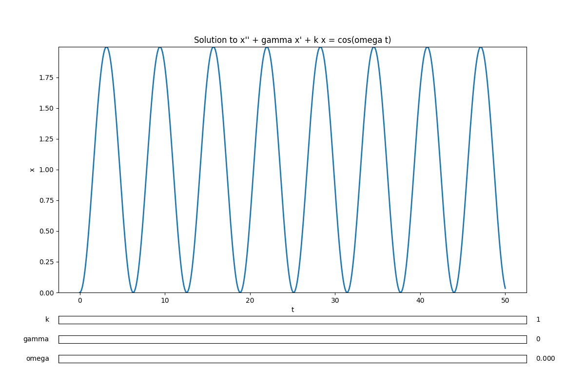
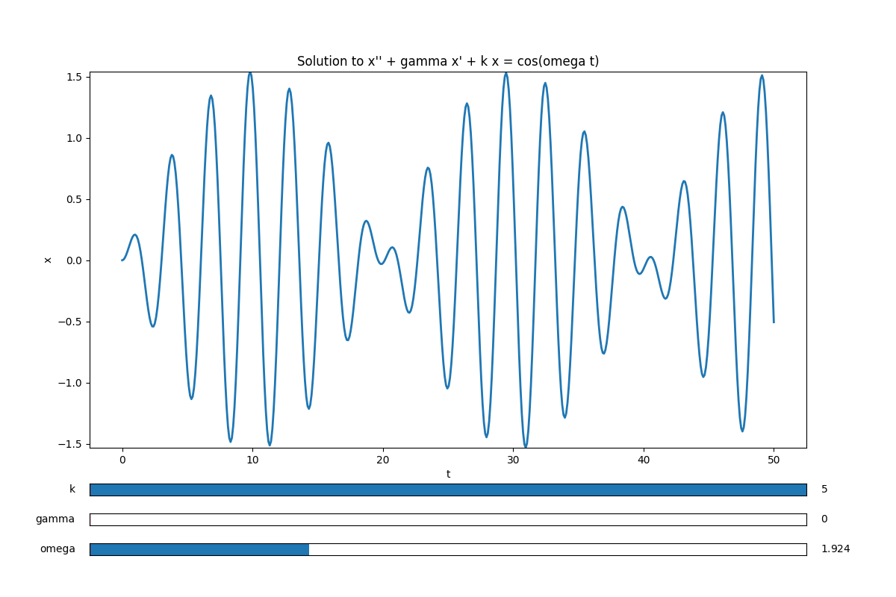
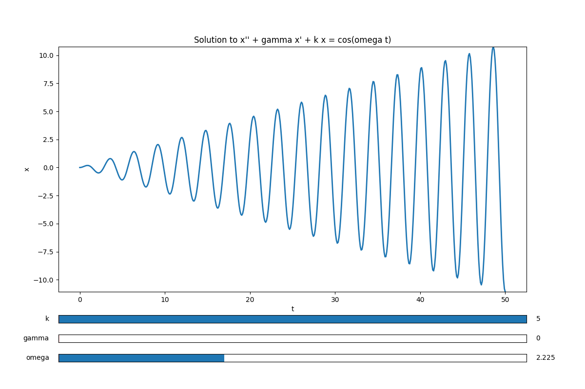
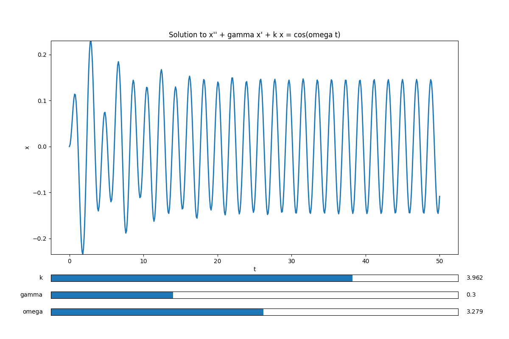

# Harmonic Oscilator
This script generates an interactive visualizer of the solution to the harmonic oscillator equation
$$x'' + \gamma x' + k x = \cos(\omega t).$$
with initial conditions $x'(0) = x(0) = 0$.
To run this code, type the command 

`python3 harmonic_oscillator.py` 

in the directory containing the file.

The output should look something like the following image. There are three slider bars for each of the three unkown constants $k, \gamma,$ and $\omega$.

## Zero Friction Situation ($\gamma = 0$)
The solution to the homogeneous equation $x'' + kx = 0$ has
natural frequency $\omega_0 = \sqrt{k}$. When the forcing frequency is not equal to the natural frequency (i.e. $\omega \neq \omega_0$), then the solution is proportional to
$$x(t) \propto \sin\left(\frac{\omega_0 - \omega}{2}\right)\sin\left(\frac{\omega_0 + \omega}{2}\right)$$
the smaller frequency $(\omega_0 - \omega)/2$ contributes to the phenomenon of beats displayed below

As forcing frequency $\omega$ the approaches the natural frequency $\omega_0$ we get the phenomenon of resonance displayed below
$$x(t) \propto \lim_{\omega \to \omega_0} \sin\left(\frac{\omega_0 - \omega}{2}\right)\sin\left(\frac{\omega_0 + \omega}{2}\right)\propto t \sin(\omega_0 t)$$

## Nonzero Friction Situation ($\gamma > 0$)
It is the case  solution is a sum $x = x_p + x_h$ where $x_p$ is a particular
solution tothe equation $x'' + \gamma x' + kx = \cos (\omega t)$ and  $x_h$ is
a solution to the homogeneous equation $x'' + \gamma x' + kx = 0$. It is the
case the limit of the homogeneous solution is zero; $\lim_{t\to \infty} x_h(t)
= 0$. Thus $x_h(t)$ can be thought of some transient interference and for
sufficiently large $t$, $x(t) \approx x_p(t)$. One can show (for instance via the method of undetermined coefficients) that $x_p$ is of the form 
$$x_p(t) = R \cos(\omega t + \phi)$$
An example of this phenomenon is pictured below

