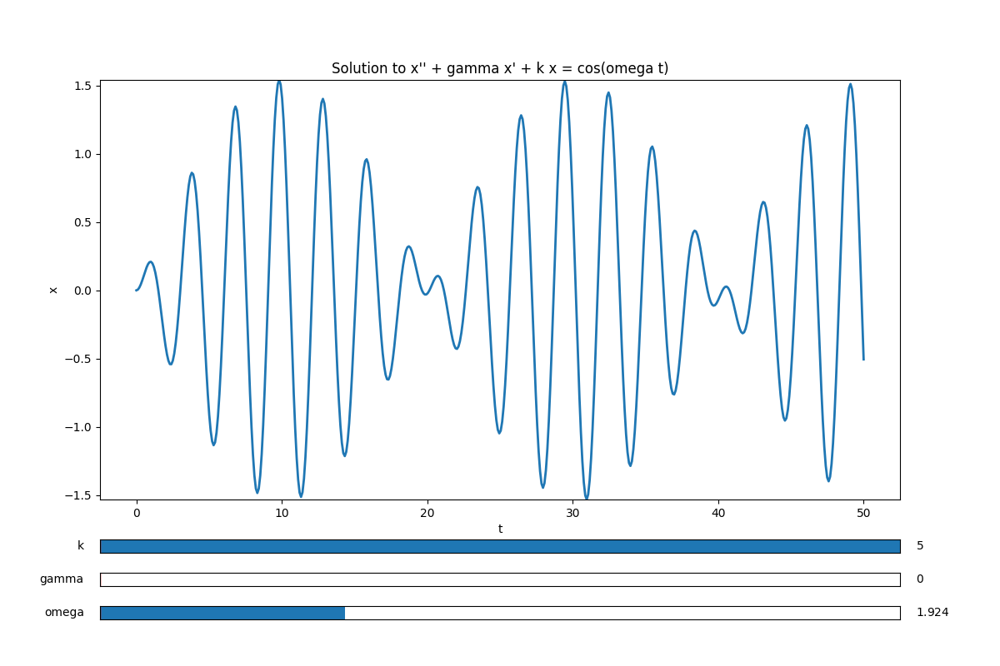
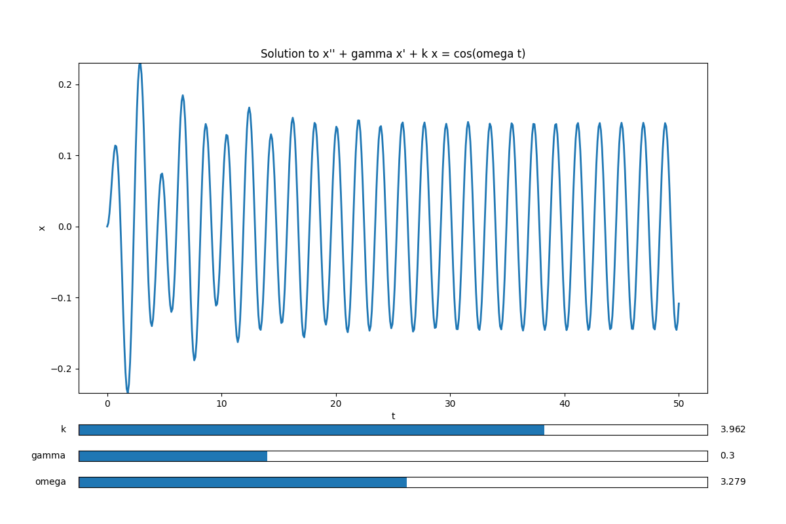

# Harmonic Oscilator
This script generates an interactive visualizer of the solution to the harmonic oscillator equation

with initial conditions .
To run this code, type the command 

`python3 harmonic_oscillator.py` 

in the directory containing the file.

The output should look something like the following image. There are three slider bars for each of the three unkown constants  and .

## Zero Friction Situation ()
The solution to the homogeneous equation  has
natural frequency . When the forcing frequency is not equal to the natural frequency (i.e. ), then the solution is proportional to

the smaller frequency  contributes to the phenomenon of beats displayed below

As forcing frequency  the approaches the natural frequency  we get the phenomenon of resonance displayed below

## Nonzero Friction Situation ()
It is the case  solution is a sum  where  is a particular
solution tothe equation  and   is
a solution to the homogeneous equation . It is the
case the limit of the homogeneous solution is zero; . Thus  can be thought of some transient interference and for
sufficiently large , . One can show (for instance via the method of undetermined coefficients) that  is of the form 

An example of this phenomenon is pictured below

